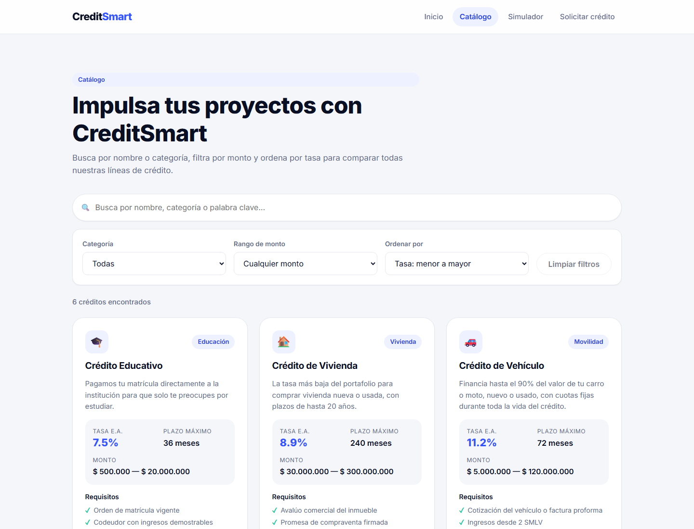
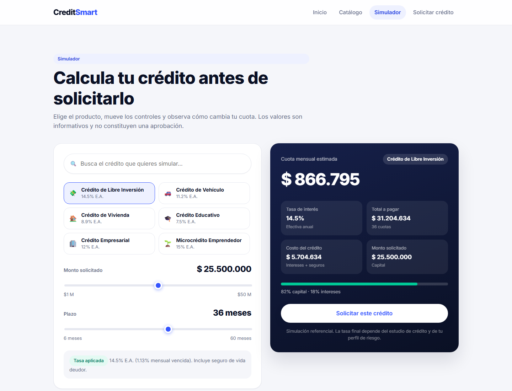

# CreditSmart · Aplicación web dinámica con React

**Estudiante:** Isabela A. V.
**Curso:** Ingeniería Web I — IU Digital
**Actividad:** S30 · EA2 — Desarrollo de aplicación web dinámica con React

---

## Descripción del proyecto

CreditSmart es la versión dinámica en React del sitio estático de la actividad anterior. Es una
fintech ficticia colombiana donde una persona puede **comparar líneas de crédito, simular su cuota
mensual y radicar una solicitud** sin salir del navegador.

Los datos se consultan desde **Cloud Firestore**: las tarjetas, los filtros, las opciones de los
selects y los productos del footer se generan con la información almacenada en la base de datos.
El archivo `src/data/creditsData.js` funciona como fuente semilla para cargar el catálogo la primera
vez, cuando la colección `creditos` está vacía.

### Qué se puede hacer

| Página | Ruta | Funcionalidad |
| --- | --- | --- |
| Inicio | `/` | Hero con métricas calculadas desde los datos, ventajas, créditos destacados (`.filter()` + `.sort()`) y pasos del proceso. |
| Catálogo | `/catalogo` | Búsqueda en tiempo real (ignora tildes y mayúsculas), filtro por categoría, filtro por rango de monto, ordenamiento por tasa/monto/plazo, botón *Limpiar filtros* y mensaje "No hay créditos disponibles". |
| Simulador | `/simulador` | Selector de crédito con buscador, sliders de monto y plazo limitados a cada producto y cálculo de cuota, total a pagar e intereses que se actualiza al instante. |
| Solicitar crédito | `/solicitud` | Formulario 100% controlado con validaciones mientras se escribe, resumen en vivo de la cuota, envío que guarda la solicitud en Firestore, mensaje de éxito y limpieza automática. |
| Mis solicitudes | `/mis-solicitudes` | Consulta solicitudes guardadas en Firestore, con búsqueda por correo electrónico y filtro por tipo de crédito. |

### Detalles de implementación que vale la pena mirar

- **Cálculo de la cuota** (`src/utils/finanzas.js`): se usa la fórmula de amortización francesa
  `C = P · i(1+i)^n / ((1+i)^n − 1)`, con la tasa efectiva anual del crédito convertida a mensual
  (`i = (1 + EA)^(1/12) − 1`). El formato de moneda se hace con `Intl.NumberFormat("es-CO")`.
- **Validaciones** (`src/utils/validaciones.js`): una función pura recibe el formulario y devuelve
  un objeto de errores; como se ejecuta en cada render, los mensajes aparecen en tiempo real.
  Incluye una regla de capacidad de pago: la cuota no puede superar el 40 % de los ingresos.
- **Comunicación entre páginas**: al pulsar *Simular* o *Solicitar* en una tarjeta se navega con
  `state` de React Router, así el crédito (y el monto/plazo simulado) llegan preseleccionados.
- **Persistencia con Firestore**: `src/firebase/Confing.js` inicializa Firebase y exporta la base de
  datos. `src/services/creditosService.js` carga los créditos y siembra el catálogo inicial solo
  cuando la colección `creditos` está vacía; `src/services/solicitudesService.js` guarda y consulta
  las solicitudes en la colección `solicitudes`.
- **Consulta de solicitudes**: la página `/mis-solicitudes` permite ver las solicitudes más
  recientes o buscarlas por correo electrónico; los datos permanecen guardados en Firestore entre
  sesiones.

## Tecnologías utilizadas

- **React 19** (componentes funcionales y hooks: `useState`)
- **React Router 7** (`BrowserRouter`, `Routes`, `Route`, `NavLink`, `Link`, `useLocation`)
- **Vite 8** como bundler y servidor de desarrollo
- **Firebase 12 / Cloud Firestore** para consultar el catálogo y guardar las solicitudes
- **CSS3 propio** (variables CSS, Grid, Flexbox, `clamp()`, diseño responsive) — sin frameworks
- **Oxlint** para el análisis estático
- **JavaScript ES6+** (`.map()`, `.filter()`, `.sort()`, desestructuración, spread, módulos)

> Sobre el diseño: siguiendo la retroalimentación del docente, antes de programar revisé
> interfaces de fintechs que ya resuelven este problema (Nu, Nequi, Lulo Bank, Wise). De ahí salen
> las decisiones visuales: fondo claro con tarjetas amplias, un único color de marca más un acento
> verde, la cuota mostrada como número grande sobre panel oscuro, sliders en lugar de campos
> numéricos y validaciones que acompañan al usuario en vez de castigarlo al enviar.

## Estructura del proyecto

```
CrediSmart-react/
├── docs/capturas/          # Imágenes usadas en este README
├── public/
├── src/
│   ├── components/         # Componentes reutilizables (uno por archivo)
│   │   ├── BarraBusqueda.jsx
│   │   ├── CampoFormulario.jsx
│   │   ├── CreditCard.jsx
│   │   ├── EstadoVacio.jsx
│   │   ├── FiltrosCreditos.jsx
│   │   ├── Footer.jsx
│   │   └── Navbar.jsx
│   ├── data/
│   │   └── creditsData.js  # Catálogo inicial para sembrar Firestore
│   ├── firebase/
│   │   └── Confing.js      # Inicialización de Firebase y Firestore
│   ├── hooks/
│   │   └── useCreditos.js  # Carga el catálogo desde Firestore
│   ├── pages/              # Una página por ruta
│   │   ├── Inicio.jsx
│   │   ├── Catalogo.jsx
│   │   ├── Simulador.jsx
│   │   ├── Solicitud.jsx
│   │   ├── MisSolicitudes.jsx
│   │   └── NoEncontrada.jsx
│   ├── services/
│   │   ├── creditosService.js     # Lectura y carga inicial de créditos
│   │   └── solicitudesService.js  # Persistencia y consulta de solicitudes
│   ├── utils/
│   │   ├── finanzas.js     # Formato COP y cálculo de cuota
│   │   └── validaciones.js # Reglas del formulario
│   ├── App.jsx             # Rutas y estado de las solicitudes
│   ├── main.jsx            # Punto de entrada + BrowserRouter
│   └── index.css           # Sistema de diseño (tokens y primitivas)
├── index.html
├── package.json
└── vite.config.js
```

Cada componente tiene su propio archivo `.css` al lado, con estilos con nombres tipo BEM.

## Instrucciones de instalación

Requisitos: **Node.js 18 o superior** y npm.

```bash
# 1. Clonar el repositorio
git clone <url-del-repositorio>
cd CrediSmart-react

# 2. Instalar dependencias
npm install

# 3. Crear la configuración local de Firebase a partir de la plantilla
cp .env.example .env

# 4. Levantar el servidor de desarrollo
npm run dev
```

Antes de iniciar la aplicación, completa en `.env` los valores de configuración de tu aplicación
web de Firebase. El proyecto debe tener Cloud Firestore habilitado y sus reglas deben permitir las
operaciones que realiza la aplicación. La plantilla incluye los nombres exactos requeridos:

```env
VITE_FIREBSASE_API_KEY=
VITE_FIREBSASE_AUTH_DOMAIN=
VITE_FIREBSASE_PROJECT_ID=
VITE_FIREBSASE_STORAGE_BUCKET=
VITE_FIREBSASE_MESSAGING_SENDER_ID=
VITE_FIREBSASE_APP_ID=
```

La aplicación queda disponible en <http://localhost:5173>. En la primera carga, si `creditos` está
vacía, se agrega el catálogo inicial; las solicitudes enviadas desde el formulario quedan guardadas
en `solicitudes`.

Otros comandos:

```bash
npm run build     # Compila para producción en dist/
npm run preview   # Sirve la versión compilada
npm run lint      # Revisa el código con Oxlint
```

## Capturas de pantalla

### Inicio


### Catálogo con búsqueda y filtros


### Simulador de crédito


### Formulario de solicitud


## Créditos y referencias

- [Documentación oficial de React](https://react.dev) — hooks y componentes.
- [Documentación de React Router](https://reactrouter.com) — `BrowserRouter`, `NavLink` y
  navegación con `state`.
- [MDN Web Docs](https://developer.mozilla.org) — `Intl.NumberFormat`, `String.normalize()` y
  métodos de arrays.
- Fórmula de amortización francesa: material de clase de matemática financiera.
